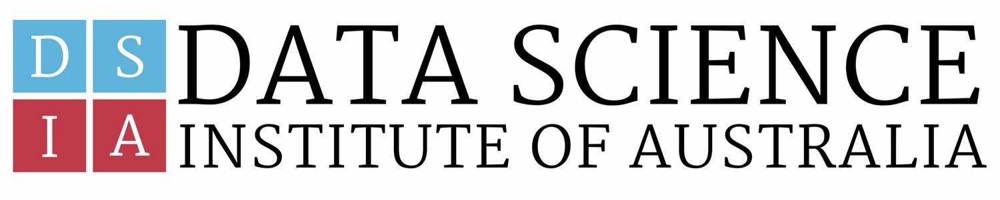

# Data Science-Melbourne's Curriculum
Part-Time Data Science & AI Curriculum in Melbourne for the Data Science Institute of Australia

- **Module 01**: Mathematics and Statistics; Python for Data Science
- **Module 02**: SQL and Databases; APIs
- **Module 03**: Exploratory Data Analysis
- **Module 04**: Introduction to Machine Learning; Regression
- **Module 05**: Supervised Machine Learning; Classification
- **Module 06**: Clustering and Unsupervised Classification
- **Module 07**: Classification and Regression Trees
- **Module 08**: Ensemble Methods
- **Module 09**: Text Analytics
- **Module 10**: Deep Learning and Neural Networks
- **Capstone**: Student's Presentation of the course's project
